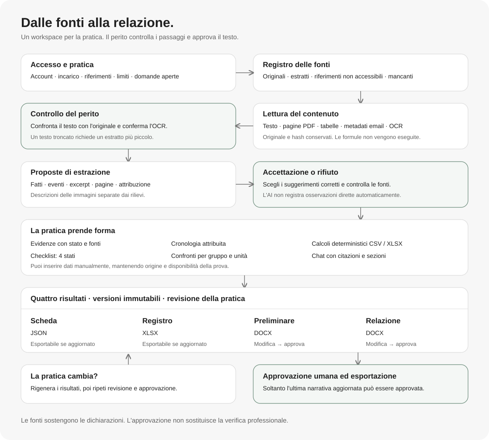
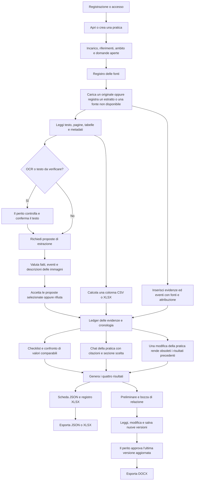

# Come funziona Expertise

Expertise è un workspace per il perito che analizza pratiche di danno alle merci e trasporto. La pratica raccoglie fonti, dichiarazioni, rilievi, calcoli e questioni aperte. L'assistente aiuta a leggerli e a preparare testi; il perito decide che cosa accettare e approvare.

## 1. Account e sessione

Crea un account con email e password oppure accedi a un account esistente. La sessione consente di vedere soltanto le tue pratiche, i tuoi documenti e le tue conversazioni. Puoi uscire dalla sessione corrente oppure terminare tutte le sessioni. Il rinnovo della sessione avviene tramite cookie protetto; la chiave Gemini rimane nel backend.

## 2. Pratica e incarico

Crea una pratica con un titolo e, se disponibili, riferimento interno, riferimento pubblico e famiglia della pratica. Nella scheda registra committente, attività richieste, limiti dell'incarico e domande aperte. Puoi modificare questi dati e lo stato di lavoro: nuova, in revisione o bozza. L'approvazione della pratica deriva dall'approvazione della relazione, non da un semplice cambio dello stato.

I dati dell'incarico descrivono il lavoro richiesto. Le quantità della spedizione, i soggetti coinvolti e il danno vanno registrati fra le evidenze con le relative fonti.

## 3. Libreria documenti e registro delle fonti

La libreria contiene gli originali caricati dal tuo account; puoi riutilizzarli in più pratiche. Sono accettati PDF, DOCX, XLSX, CSV, PNG, JPEG, TIFF a una pagina ed EML, fino a 10 MiB per file. Puoi scaricare l'originale, leggere il contenuto estratto e rimuovere un documento dalla libreria. La rimozione rende non accessibile l'originale nelle pratiche collegate e rende obsoleti i relativi risultati; il riferimento nel registro rimane.

Ogni fonte di una pratica riceve un codice, per esempio `DOC-001`. Il registro conserva nome, tipo di documento, data, autore o mittente, finalità della verifica, disponibilità e hash dell'originale quando presente. Puoi registrare:

- **Originale accessibile:** un file della libreria collegato alla pratica.
- **Solo estratto:** testo copiato oppure un file contenente soltanto una parte del documento.
- **Citato, non accessibile:** un documento menzionato nelle fonti, di cui non hai l'originale.
- **Non fornito:** un documento atteso o richiesto che non è stato consegnato.

Non devi caricare un file inventato per documentare un originale mancante. Puoi aprire le fonti e controllare gli excerpt usati dalle evidenze o dalle risposte dell'assistente.

## 4. Lettura del contenuto e revisione OCR

Il sistema legge i paragrafi DOCX, le pagine PDF, le tabelle CSV/XLSX e i metadati delle email. Le immagini e le pagine scansionate passano attraverso OCR. Il testo OCR richiede sempre controllo umano: confrontalo con l'originale, poi confermalo. Se il testo è troncato, non puoi dichiararlo completo; puoi fornire un estratto più piccolo e indicarne l'ambito.

Le formule Excel rimangono testo: il sistema non le esegue. Un allegato email menzionato nel messaggio non diventa automaticamente una fonte letta.

## 5. Proposte di estrazione

Chiedi l'estrazione AI di una fonte accessibile o di un estratto registrato. Ottieni proposte di fatti e di eventi, con excerpt, pagine e attribuzione quando disponibili. Le immagini PNG/JPEG possono avere anche una proposta di descrizione separata.

Seleziona i suggerimenti corretti e accettali oppure rifiuta la proposta. I suggerimenti non selezionati rimangono non accettati. L'accettazione di una descrizione fotografica registra la revisione della descrizione e non crea un rilievo osservato. Una proposta ormai decisa non può essere accettata di nuovo. Se la pratica cambia mentre l'assistente lavora, devi richiedere una nuova estrazione sul contesto aggiornato.

## 6. Evidenze, quantità e attribuzione

Puoi registrare manualmente un'evidenza con campo, valore, unità, gruppo di confronto, stato e fonti. Il gruppo distingue, per esempio, i due container o un lotto dal totale della spedizione. Un confronto automatico considera soltanto lo stesso campo, la stessa unità e lo stesso gruppo assegnato dal perito.

| Stato | Significato |
| --- | --- |
| Osservato | Rilievo diretto supportato da una fonte idonea, come note d'ispezione accessibili. |
| Riportato | Dichiarazione attribuita a una persona o a un mittente. |
| Scritto nel documento | Dato presente nella fonte, senza trasformarlo in osservazione diretta. |
| Calcolato | Risultato deterministico ottenuto da dati e metodo registrati. |
| Contestato | Dichiarazione o valore in discussione. |
| Non verificato | Informazione non accertata; la mancanza di una fonte è esplicita. |

Le evidenze diverse da “non verificato” richiedono una fonte. La fonte deve essere adatta allo stato scelto: un'email o un ordine giudiziario non documenta da solo un'osservazione diretta del perito. L'assistente non assegna automaticamente lo stato “osservato”.

## 7. Cronologia

Aggiungi un evento con descrizione, data se nota, tipo di data, stato, attribuzione e riferimenti alle fonti. Puoi distinguere la data dell'evento, quella del documento o della ricezione, oppure indicare un tipo non verificato, senza attribuire a una data un significato diverso da quello attestato. Gli eventi accettati dalle proposte entrano nello stesso registro.

## 8. Calcoli sulle tabelle

Su una fonte CSV/XLSX scegli foglio, riga delle intestazioni, colonna, operazione, unità e separatori numerici. Sono disponibili somma, minimo, massimo, media, conteggio e intervallo minimo/massimo. Il risultato viene salvato tra le evidenze come calcolato, insieme a hash del file, intervallo di righe, versione del metodo e numero di celle escluse. Celle vuote, formule ed errori del sensore non sono sostituiti da valori inventati.

## 9. Checklist e questioni aperte

Registra una verifica con titolo, spiegazione, eventuale severità, controllo suggerito ed evidenze collegate. Puoi aggiornarla mentre lavori. I quattro stati sono **verificato**, **problema trovato**, **non verificabile**, **non applicabile**. Un riferimento a una regola e alla sua versione è un dato inserito dal perito: non attiva un motore automatico di scadenze legali.

La revisione preliminare affianca questa checklist ai confronti deterministici e alle fonti non disponibili. Le domande aperte della pratica entrano nei risultati senza diventare conclusioni.

## 10. Conversazioni della pratica

Avvia una conversazione sulla pratica e continua dallo storico. Puoi scegliere fino a dieci documenti oppure usare il contesto disponibile della pratica; puoi indirizzare una richiesta a una sezione della relazione. Il contesto comprende una cronologia breve della conversazione e quantità limitate di testo delle fonti.

Le risposte mostrano citazioni da aprire e confrontare con l'originale o l'estratto. Se una citazione non corrisponde al testo fornito, la risposta viene rifiutata. Se il servizio AI non risponde, il messaggio dell'utente può rimanere nello storico senza una risposta dell'assistente. Puoi riprovare in una conversazione esistente o aprire quella conservata nello storico. Le conversazioni possono essere eliminate.

La chat non modifica automaticamente le evidenze, le verifiche o la relazione. Le richieste su una sezione usano la sua ultima versione manuale aggiornata; una modifica concorrente richiede un nuovo tentativo.

## 11. I quattro risultati

Puoi generare tutte le uscite insieme oppure aggiornare un singolo risultato. La generazione congiunta salva tutti e quattro i risultati o nessuno.

| Risultato | Contenuto | Esportazione |
| --- | --- | --- |
| Scheda strutturata | Pratica, fonti, evidenze, eventi, verifiche e domande aperte. | JSON, anche in bozza aggiornata. |
| Registro documenti | Fonti e loro disponibilità, metadati e originali. | XLSX, anche in bozza aggiornata. |
| Revisione preliminare | Cronologia, differenze comparabili, fonti mancanti, checklist e limiti. | DOCX dopo approvazione. |
| Bozza di relazione | Oggetto e limiti, merce/trasporto, eventi, danno/rilievi, valutazione economica e questioni aperte. | DOCX dopo approvazione. |

Per le due narrative puoi chiedere suggerimenti AI, leggere il contenuto, modificarlo e salvarlo come nuova versione. I suggerimenti restano riconoscibili come proposte. La storia conserva le versioni precedenti. È disponibile soltanto il template generico italiano per danni alle merci; non esiste un'anteprima PDF della relazione.

## 12. Approvazione, versioni e aggiornamenti

Controlla il testo e le fonti prima di approvare. Puoi approvare soltanto l'ultima versione non ancora approvata e basata sulla revisione corrente della pratica. Dopo l'approvazione, scarica la narrativa in DOCX.

Nuove fonti, estrazioni, evidenze, eventi, verifiche o modifiche dei dati della pratica possono rendere obsolete le versioni precedenti. Un risultato obsoleto non può essere approvato o esportato come corrente: genera una nuova versione e ripeti la revisione. Una nuova versione della relazione riporta la pratica in bozza.

## Esempio di lettura corretta di una pratica marittima

Registra separatamente 1080 colli/29 pallet e 894 colli/34 pallet dei due container. Un tally di 24 pallet con ambito non verificato rimane un dato parziale: non è automaticamente una differenza contro il totale. Una posizione del vettore di USD 31500 rimane attribuita al vettore e non diventa il danno accertato. Email, ordine giudiziario e descrizioni fotografiche non sostituiscono gli originali o i rilievi diretti. La relazione espone quanto risulta dalle fonti e ciò che resta da verificare.

## Percorso tecnico e limiti

Il frontend React/Vite chiama le route `/api` del backend Nest. Il backend controlla sessione, proprietà, DTO e limiti prima di leggere PostgreSQL o lo storage privato. I parser producono testo e metadati; i calcoli sono deterministici; Gemini restituisce JSON validato e citazioni controllate. Le modifiche e le approvazioni usano transazioni e revisione della pratica.

Gli errori richiedono un'azione concreta: correggere l'input (`400`), accedere di nuovo (`401`), controllare la configurazione dell'origine (`403`), cercare la risorsa corretta (`404`), ricaricare un contesto cambiato o riutilizzare un file duplicato (`409`), ridurre il file/payload (`413`), attendere il limite di richieste (`429`) oppure riprovare quando l'assistente è disponibile (`503`). Il dettaglio delle route e dei controlli si trova nell'[audit](../api/docs/audit-2026-10-09.md).

Il prodotto non implementa ancora template specialistici per ogni modalità e merce, catalogo governato di regole legali, anteprima PDF, ricerca semantica delle fonti, coda distribuita di elaborazione o quote cumulative dello storage. Il frontend rende utilizzabili le funzionalità effettivamente disponibili.
