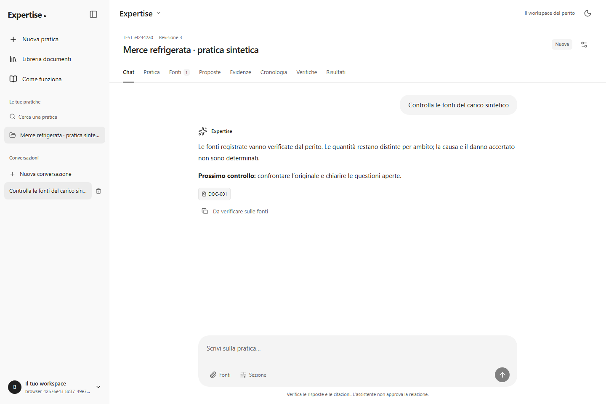
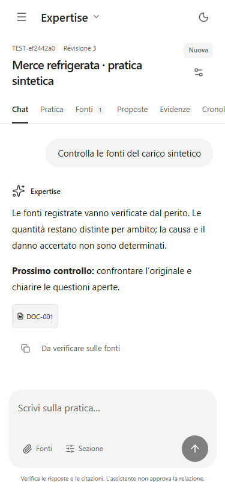
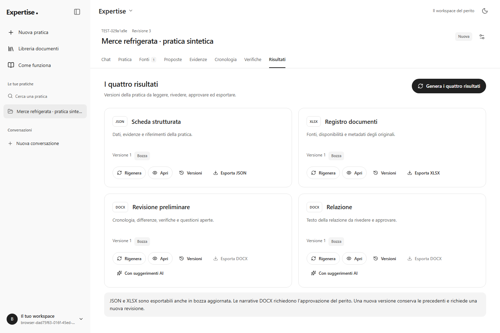
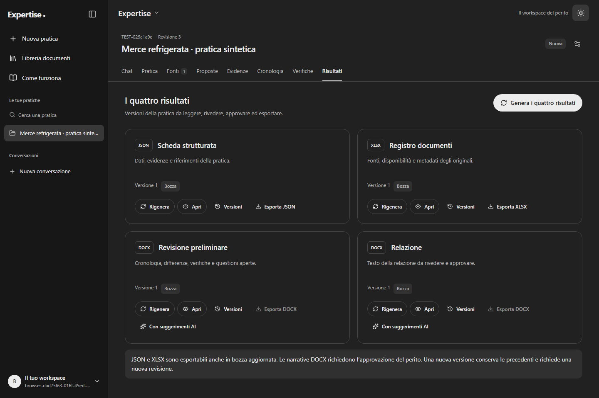

# Verifica del frontend — 10 ottobre 2026

Il workspace React/Vite implementa le funzionalità disponibili nel backend Nest. Il [piano](frontend-plan.md) è stato scritto e committato prima dell'implementazione. Il [flusso completo](app-flow.md), con [diagramma SVG](app-flow.svg), descrive ogni funzione e viene mostrato anche nella guida dell'app.

## Risultati e perimetro

- Build di produzione, TypeScript strict, lint type-aware, formato e suite Vitest verificati con `npm run check`.
- **43 test Vitest/Testing Library in 9 file:** trasporto/sessione, form, editor, lettore OCR, disponibilità delle fonti, recupero della revisione OCR, accettazione in lotti da 100, limite dello storico, JSON finito/profondità, valori reali delle proposte e significato delle date.
- **21 scenari Playwright in 5 file, tutti passati su Chromium:** interfaccia reale, API Nest compilata, PostgreSQL 18.6 e filesystem temporanei.
- Gemini simulato nei browser test isolati: questi scenari verificano workflow, validazione e gestione degli errori. Il contatore di throttling è sostituito nelle fixture browser; i **117 test HTTP del backend** verificano separatamente il rate limit reale e tutte le **43 route**. Nessun account, documento o database configurato è usato dalle fixture isolate.
- Una seconda suite, `npm run test:live-ui`, comprende otto scenari contro i servizi già avviati, il database configurato e Gemini reale, senza modificare il throttling. Le prove, gli esiti effettivi del provider e gli screenshot sono nel [collaudo UI live](live-ui-verification-2026-10-10.md).
- Audit delle dipendenze API e web senza vulnerabilità note. I risultati possono cambiare quando vengono pubblicati nuovi advisory.
- Axe senza violazioni nei controlli WCAG A/AA applicati alle otto schermate della pratica, alla guida, ai dialoghi controllati, alla navigazione mobile e ai risultati in tema scuro. Controllati anche Tab, Escape, ritorno del focus, reduced motion e testo ingrandito tramite dimensione del font radice. Non è una certificazione di accessibilità né un test completo con screen reader o zoom nativo di ogni schermata.

Il backend supera **151 test unitari/browser più 117 HTTP**, con **88,24% linee**, **88,31% statements**, **79,07% branch**, **89,86% funzioni** nella misura Istanbul completa dei 268 test. Dettagli, esempi marittimi/stradali/aerei/ferroviari, matrice delle route e limiti nell'[audit](../api/docs/audit-2026-10-09.md).

## Mappa delle funzionalità e delle prove

| Area                   | Comportamento verificato                                                                                                                                                                                             | Prove                                                                                                                                                    |
| ---------------------- | -------------------------------------------------------------------------------------------------------------------------------------------------------------------------------------------------------------------- | -------------------------------------------------------------------------------------------------------------------------------------------------------- |
| Account                | Registrazione, login, ripristino cookie, rinnovo coordinato, cache privata, scadenza, logout comunicato agli altri tab                                                                                               | `api-client.test.ts`, `AuthPage.test.tsx`, `workspace.spec.ts`, `security.spec.ts`; logout globale anche nella suite HTTP                                |
| Pratiche               | Creazione, modifica dell'incarico, navigazione e risorse di un altro proprietario invisibili                                                                                                                         | `workspace.spec.ts`, `resilience.spec.ts`, controlli HTTP dei DTO e della proprietà                                                                      |
| Libreria               | Upload originale, file vuoto/troppo grande/duplicato, lettura, download binario e rimozione                                                                                                                          | `workspace.spec.ts`, `additional-workflows.spec.ts`, `security.spec.ts`, `resilience.spec.ts`                                                            |
| Fonti                  | Originale, estratto, citato non accessibile, non fornito; proposte automatiche solo da originali; PNG/JPEG analizzabili visivamente senza conferma OCR                                                               | `SourcesPage.test.tsx`, `resilience.spec.ts`, workflow browser e test HTTP dei parser                                                                    |
| Lettore                | Conferma OCR esplicita, testo vuoto o troncato non dichiarabile completo; quote apribili                                                                                                                             | `DocumentReader.test.tsx`, `workspace.spec.ts`, unitari PDF/OCR ed estrazioni HTTP                                                                       |
| Proposte               | Accetta selezionati, rifiuta proposta senza creare evidenze, mantieni gli altri pendenti; massimo 100 per invio                                                                                                      | `ReviewPage.test.tsx`, `workspace.spec.ts`, `additional-workflows.spec.ts`, test HTTP su doppia accettazione e race                                      |
| Evidenze e calcoli     | Evidenza non verificata, fonte obbligatoria per stati diversi, osservazione inammissibile rifiutata senza perdere il form; media con decimali italiani e metodo consultabile                                         | `workspace.spec.ts`, `resilience.spec.ts`; tutte le sei operazioni e i casi numerici limite nei test API                                                 |
| Cronologia e checklist | Significato della data/riferimento fonte, creazione e modifica della verifica con riferimento regola conservato                                                                                                      | `workspace.spec.ts`; attribuzione, quattro stati e ownership nei test HTTP                                                                               |
| Chat                   | Citazione autentica apribile, scelta fonti, contesto della sezione corrente, errori AI senza risposta inventata, copia ed eliminazione                                                                               | `workspace.spec.ts`, `additional-workflows.spec.ts`, `resilience.spec.ts`                                                                                |
| Storico chat           | Ultima pagina, caricamento precedente senza ritorno automatico in fondo, nuovi messaggi attraverso il confine della pagina; nuova conversazione quando lo storico non può contenere un'altra coppia domanda/risposta | `resilience.spec.ts` con 102 messaggi, `ChatPage.test.tsx` con i limiti 100048/100049                                                                    |
| Risultati              | Generazione atomica delle quattro uscite e generazione singola; modifica manuale, suggerimenti AI mirati, conservazione del testo corrente e storico immutabile                                                      | `workspace.spec.ts`, `additional-workflows.spec.ts`, `ArtifactEditor.test.tsx`; rollback, rigenerazione obsoleta e concorrenza verificati anche via HTTP |
| Approvazione/export    | DOCX bloccato prima dell'approvazione, approvazione corrente, JSON/XLSX/DOCX scaricati e riletti; fonte eliminata rende obsolete le uscite                                                                           | `workspace.spec.ts`, `resilience.spec.ts`, test HTTP di doppia approvazione e versione superata                                                          |
| Sicurezza UI           | HTML/script/URL JavaScript inerti, immagini remote non caricate, token fuori da storage persistente, cookie HttpOnly, dati di altre pratiche esclusi                                                                 | `security.spec.ts`, `api-client.test.ts`, `resilience.spec.ts`                                                                                           |
| Responsive e guida     | Desktop 1440×960, mobile 375×812, tema scuro, focus nei dialoghi, composer nel viewport, assenza di overflow orizzontale della pagina                                                                                | `accessibility.spec.ts` e ispezione degli screenshot                                                                                                     |

I file unitari si trovano in `web/src`, quelli Playwright in `web/tests`. Per comandi, dipendenze, porte e hosting vedere il [README web](../web/README.md). Non sono stati aggiunti mock di dati o risposte all'applicazione distribuita: le fixture restano nei test.

## Verifica visiva

Screenshot della suite browser completata, con account e pratica sintetici. Sono stati aperti e controllati: gerarchia, leggibilità, spaziatura, composer, tema e disposizione responsive.

## Correzioni emerse nelle prove

Le prove hanno portato a correggere ripristino del focus nei dialoghi, focus trap del menu mobile, cache dei risultati dopo lettura/rimozione di una fonte, testo non salvato durante aggiornamenti concorrenti, passaggio fra editor JSON e editor strutturato, disponibilità delle proposte sugli estratti, PATCH della checklist, selezioni oltre 100 e scorrimento dello storico. La narrativa AI ora conserva il testo manuale corrente e tiene i suggerimenti separati.

Un'esecuzione Playwright è rimasta senza server Vite su Windows. Il server della fixture imposta `CI=true` per lasciare al runner la chiusura, senza terminare quando si chiude una pipe non interattiva. Due asserzioni usavano inizialmente percorsi API errati e sono state corrette confrontandole con il client reale. L'esecuzione completa supera tutti i 21 scenari, senza retry locali. Le terminazioni intermittenti osservate nel runner di copertura Windows sono registrate nell'audit; una prova interrotta non viene contata come superata.

Il collaudo sul database configurato ha trovato e corretto anche lo schema non aggiornato, il recupero della prima chat dopo `503`, il link alle fonti, i valori delle proposte, il JSON non finito, la spiegazione dei rilievi osservati, i reload provocati dai report HTML e l'attribuzione/data dei DOCX. Questi difetti non erano coperti dalla prima suite. Sono stati aggiunti controlli HTTP, unitari e browser sui comportamenti corretti; i dettagli e le verifiche manuali sono nel [report live](live-ui-verification-2026-10-10.md).

## Limiti delle verifiche

I browser verificati sono Chromium e Brave; non sono stati eseguiti Firefox, Safari o dispositivi fisici. I documenti sono sintetici, con casi settoriali ed errori controllati. Oltre al flusso aereo precedente, il collaudo UI ha completato una sequenza marittima con estrazione, chat citata e narrativa reali. Altre chiamate hanno ricevuto `503`: la relativa prova verifica il recupero, senza contare la generazione come riuscita. Il cambio fra tutti i modelli su `429` è verificato con mock, non dal vivo.

La paginazione API arriva all'offset 100000; una conversazione molto grande deve proseguire in una nuova chat prima di superare lo storico consultabile. Template specialistici, regole legali governate, anteprima PDF e retrieval semantico rimangono estensioni non implementate. Il database configurato è stato aggiornato durante il successivo collaudo live, dopo backup e controllo dei duplicati; le suite isolate continuano a usare soltanto database temporanei.
