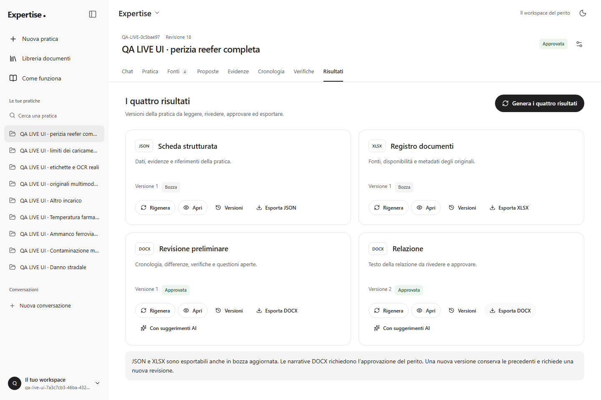
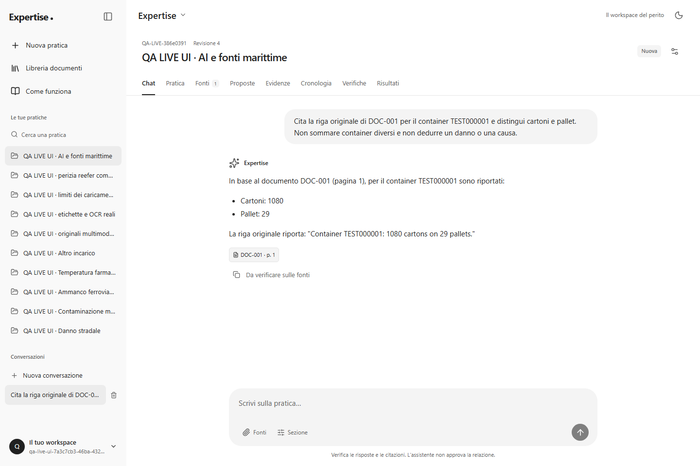
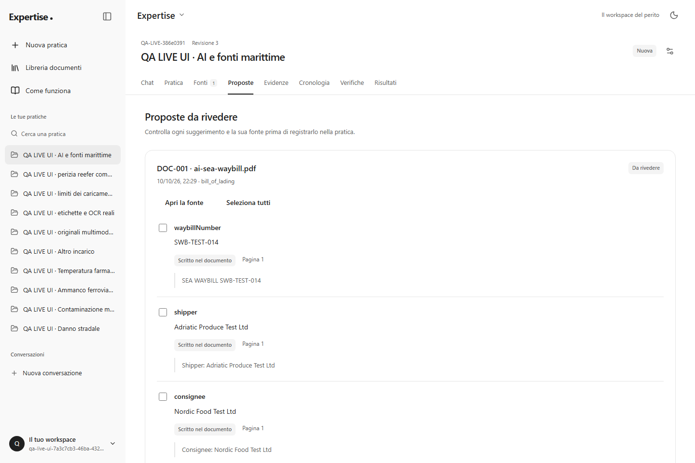
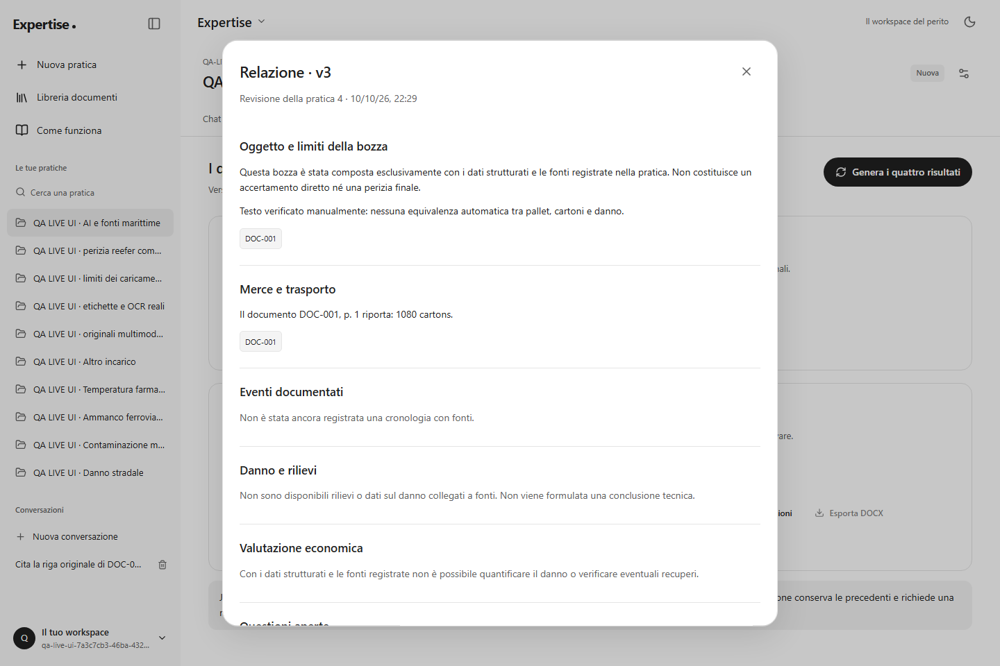
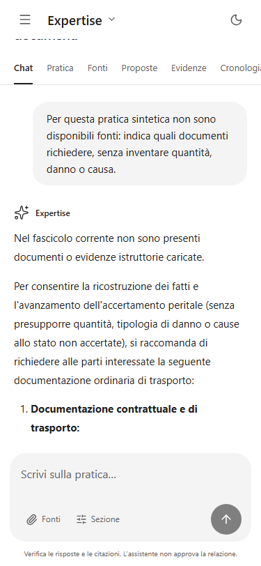

# Collaudo UI sul server reale — 10 ottobre 2026

Il collaudo nasce dal `500` mostrato aprendo una pratica e tentando una chat. Sono state usate la pagina già aperta in Brave e sessioni Chromium dedicate contro il frontend su `localhost:5173`, l'API su `3000` e il PostgreSQL configurato nel progetto. Questa prova usa servizi, storage, cookie, throttling e Gemini reali. I documenti caricati e inviati all'AI sono sintetici; i documenti personali già presenti nella libreria non sono stati analizzati o trasmessi.

## Causa del blocco e ripristino

Il database aveva quattordici migrazioni applicate e due pendenti: `20261010200000_document_integrity` e `20261010201000_event_attribution`. La colonna `case_events.attribution` mancava: Prisma falliva anche nella lettura della pratica senza eventi, mentre la lista laterale poteva funzionare. Il filtro restituiva un errore generico senza una categoria utile alla diagnosi.

Prima della migrazione è stato salvato un backup PostgreSQL in formato custom fuori dal repository, nella cartella temporanea `expertise-ui-backup-20261010-JmunWZ`. Verificata l'assenza di duplicati attivi per proprietario/hash, entrambe le migrazioni sono state applicate. Sono stati conservati la pratica originale e i quattro record documentali dell'account esistente: due attivi e due già rimossi l'8 ottobre. L'API che stava girando usava ancora il codice compilato precedente: è stata ricompilata e riavviata, poi verificata sul browser.

Gli script `npm run start*` ora controllano lo stato delle migrazioni prima dell'avvio, senza applicarle automaticamente. Se si avvia direttamente Node con uno schema vecchio, `P2021`/`P2022` producono un `503` con codice `DATABASE_SCHEMA_OUTDATED` e una spiegazione distinta dagli errori AI. I log includono categoria e codice Prisma, senza SQL, valori dei record o segreti.

## Difetti trovati usando l'app

| Difetto                                                                        | Correzione e prova                                                                                                                                                                                                                                                                                                  |
| ------------------------------------------------------------------------------ | ------------------------------------------------------------------------------------------------------------------------------------------------------------------------------------------------------------------------------------------------------------------------------------------------------------------- |
| Pratica e chat bloccate dalla colonna mancante                                 | Migrazioni reali applicate; regressione HTTP con colonna temporaneamente rinominata nel database isolato, ripristino e risposta `200`; preflight CLI verificato.                                                                                                                                                    |
| Primo messaggio salvato ma conversazione non aperta dopo un errore AI          | Creazione atomica di chat/messaggio; l'errore restituisce l'ID salvato. La UI apre quella conversazione e conserva l'avviso. Il retry usa la stessa chat.                                                                                                                                                           |
| Link “Aggiungi una fonte” nella chat vuota diretto al percorso errato          | Percorso assoluto della pratica corrente; prova reale e regressione browser.                                                                                                                                                                                                                                        |
| Proposte con “Non verificato” al posto di quantità e testo                     | La UI legge `numericValue ?? valueText`, come il contratto effettivo dell'estrazione. Verificati testo, quantità e zero prima dell'accettazione.                                                                                                                                                                    |
| `1e400` in un campo JSON trasformato silenziosamente in `null`                 | Rifiuto dei numeri non finiti prima della serializzazione; errore italiano, testo conservato. Zero, false e null restano distinti. La profondità del JSON rispetta il limite API anche prima dell'invio.                                                                                                            |
| Rilievo “Osservato” rifiutato con spiegazione poco utilizzabile                | Avviso italiano che indica la fonte necessaria e lo stato “Riportato”; campo, valore, attribuzione e riferimento rimangono correggibili.                                                                                                                                                                            |
| Report e tracce HTML provocavano reload durante il collaudo                    | Cartelle di verifica escluse dal watcher e negate dal server Vite; nuova prova con bozza non inviata e tre file HTML. Configurazione secondo la [documentazione di Vite](https://vite.dev/config/server-options.html#server-watch).                                                                                 |
| Attribuzione e significato della data potevano scomparire dalla relazione DOCX | Il testo conserva il soggetto registrato per tutti gli stati della prova e distingue data dell'evento, del documento, di ricezione e non verificata. La revisione preliminare esportata mantiene la stessa distinzione; il lettore mostra etichette italiane. DOCX reali riletti e confrontati con i dati inseriti. |

Le cartelle delle due suite Playwright sono state separate: il runner ordinario puliva la propria directory e, nella prima configurazione, poteva rimuovere i download del runner live annidato al suo interno. Un'altra esecuzione si è interrotta dopo cinque scenari perché il processo Vite non era più in esecuzione; i log non ne dimostrano la causa. Il server è stato riavviato con `CI=true` per gestire le pipe non interattive su Windows e l'esecuzione completa successiva è passata. Le esecuzioni interrotte o fallite non sono conteggiate come superate. Non sono stati aumentati timeout o disattivati rate limit per far passare questi casi.

## Prove da perito

La suite live comprende otto scenari, con molte azioni e asserzioni in ciascuno:

| Scenario                | Azioni e risultati controllati                                                                                                                                                                                                                                                                                             |
| ----------------------- | -------------------------------------------------------------------------------------------------------------------------------------------------------------------------------------------------------------------------------------------------------------------------------------------------------------------------- |
| Apertura dell'incarico  | Cinque famiglie della pratica, metadati, incarico, domande, titolo vuoto/whitespace e collegamento alle fonti. Registrazione dal form con password non coincidenti e successiva correzione.                                                                                                                                |
| Documenti di settore    | Sea waybill PDF con due container; survey stradale DOCX con cinque cartoni bagnati e causa ignota; reclamo aereo DOCX con importo dichiarato; lettera ferroviaria PDF con pesi netti/lordi distinti; logger XLSX e CSV italiano; email EML con metadati e allegato citato. Lettura dal browser e libreria degli originali. |
| Immagini e OCR          | PNG, JPEG e TIFF a pagina singola: etichetta sintetica con container, quantità e sigillo. Testo riconosciuto; conferma inizialmente disabilitata, confronto esplicito e revisione registrata.                                                                                                                              |
| Upload invalidi         | File vuoto, oltre 10 MiB, PDF contraffatto e duplicato. Errori visibili con modulo disponibile; download CSV confrontato byte per byte con l'originale.                                                                                                                                                                    |
| Perizia reefer completa | Sei calcoli: somma −40 °C, minimo −18,5 °C, massimo −4 °C, media −10 °C, conteggio 4 e range 14,5 °C. Errori sensore esclusi, metodo/hash consultabili; causa ignota, evento con significato e attribuzione, quattro esiti checklist.                                                                                      |
| Revisione ed export     | Quattro risultati generati, DOCX bloccati prima dell'approvazione; modifica manuale della relazione, versione precedente immutata; approvazione esplicita e quattro download. Una fonte aggiunta dopo l'approvazione rende obsolete tutte le uscite e blocca l'export.                                                     |
| AI con fonti            | Estrazione di sea waybill, confronto di una quantità con la citazione dell'originale e accettazione selettiva; chat con citazione apribile; suggerimenti mirati alla sezione e testo manuale conservato. Gli esiti effettivi dell'AI sono registrati separatamente.                                                        |
| Input e recupero chat   | JSON non finito/troppo annidato, zero/false/null, osservazione inammissibile corretta in dichiarazione attribuita; prima chat senza fonti, navigazione all'ID salvato, una risposta reale oppure recupero esplicito di `503`. Desktop e mobile senza overflow della pagina.                                                |

Nella sessione manuale Brave, la conversazione inizialmente fallita è rimasta la stessa. Dopo il ripristino ha risposto sull'estratto del tally: 24 pallet soltanto nel primo lotto, conteggio cartoni non verificato, USD 31.500 come posizione del vettore e causa non accertata. Le citazioni si aprono e rimandano al testo registrato, indicato correttamente come “Solo estratto”. Il caso sintetico `COLLAUDO UI 10-10 · Reefer marittimo` resta disponibile nell'account esistente come esempio consultabile.

I quattro file dell'ultima perizia sono stati riletti dopo il download: il JSON mantiene media −10 °C, range 14,5 °C e causa `unknown`; l'XLSX contiene quattro fonti con i quattro stati di disponibilità, hash soltanto per l'originale e nessuna formula eseguita; entrambi i DOCX mantengono approvazione, soggetto e data di ricezione. La relazione conserva anche la nota manuale del perito. Lo storico precedente resta immutato.

## Esito delle verifiche e pulizia

| Verifica                                      | Esito                                                                                                                     |
| --------------------------------------------- | ------------------------------------------------------------------------------------------------------------------------- |
| Backend unitari e HTTP con copertura          | 268 passati in 19 file: 151 unitari/browser e 117 HTTP.                                                                   |
| Copertura Istanbul completa                   | Linee 88,24%; statements 88,31%; branch 79,07%; funzioni 89,86%.                                                          |
| Frontend build, tipi, lint, formato e unitari | `npm run check` completato; 43 test passati in 9 file.                                                                    |
| Browser con backend/database temporanei       | 21 scenari Chromium passati, senza retry locali.                                                                          |
| Browser sul server configurato                | 8 scenari live passati, senza retry, senza mock Gemini o sostituzione del rate limit.                                     |
| Gemini nell'ultima esecuzione live            | Estrazione `201`, un fatto verificato/accettato, chat citata `201`, narrativa mirata `201`, prima chat senza fonti `201`. |
| Export riletti                                | JSON, XLSX e due DOCX verificati dopo il download reale.                                                                  |
| Dipendenze API e frontend                     | Audit npm: 0 vulnerabilità note al momento del controllo.                                                                 |

Al termine sono stati disattivati esclusivamente i 24 account con email UUID `qa-live-ui-...@example.test` creati da questa suite. I loro 79 casi, 88 documenti e 11 chat sono stati marcati come rimossi, e 80 sessioni ancora attive sono state revocate. È stato usato il soft delete, conservando i dati e i file; il manifest dei soli ID modificati resta nella directory locale ignorata `api/.temp`. La verifica successiva non trova più account QA attivi. L'account originale, `Danno 1`, i suoi documenti e l'esempio manuale sono invariati. `Danno 1` è stato riaperto nel browser senza errore; la chat dimostrativa con risposta reale è stata lasciata aperta in Brave.

Chi ripete `npm run test:live-ui` crea nuovi dati nel database configurato: la suite salva le email e gli ID prodotti, ma non esegue automaticamente la pulizia. Eventuali rimozioni devono restare limitate agli account e ai record del proprio collaudo.

## Gemini reale e limiti

È stata osservata una sequenza reale completa con estrazione `201`, un fatto accettato dopo verifica, chat `201` con citazione verificata e narrativa mirata `201`, mantenendo il testo manuale. L'[osservazione salvata](screenshots/live/provider-success.json) contiene solo gli esiti, senza credenziali. Altre esecuzioni hanno ricevuto `503` da Gemini: in quei casi sono stati verificati l'avviso, la conservazione dei dati e l'assenza di una risposta inventata, senza dichiarare riuscita la generazione.

Il passaggio fra tutti i modelli su `429` rimane verificato con risposte controllate. Non è stata provocata intenzionalmente una quota reale esaurita. I documenti sono sintetici; il collaudo non certifica precisione OCR/AI su ogni perizia reale, ogni browser o ogni input possibile. Firefox, Safari, dispositivi fisici e assistive technology complete non sono stati collaudati.

## Evidenze visive

Screenshot del frontend reale, con pratiche e account sintetici:

Il [flusso visivo e testuale completo](app-flow.md) e la guida dentro l'app descrivono tutte le funzionalità. Per la matrice delle route e dei casi di sicurezza vedere l'[audit backend](../api/docs/audit-2026-10-09.md); per sessioni, concorrenza, paginazione e accessibilità vedere la [verifica frontend](frontend-verification.md).
